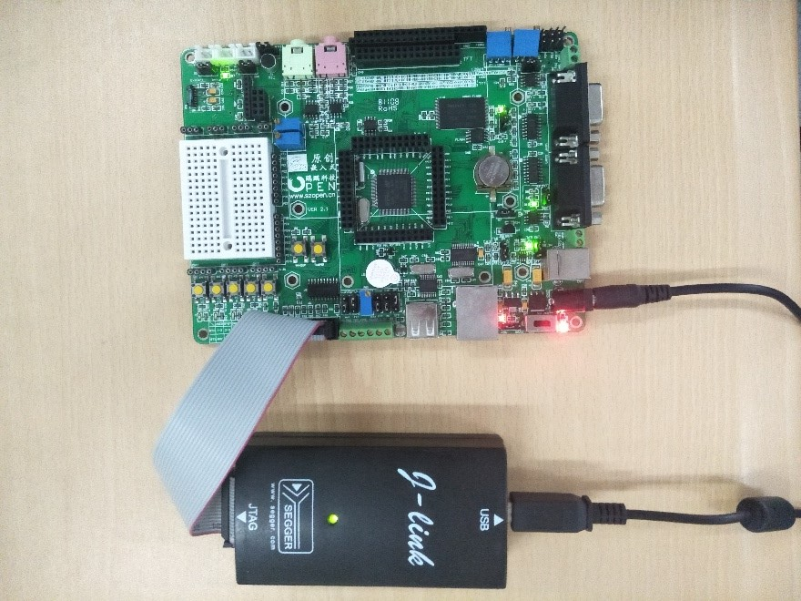

# Embedded-Systems

> ## `ARM Microcontrollers`
>
> > - ARM Cortex-M
> > - STM32F103VC
> > - Keil5 TLE9879
> > - LM4F120

## Shape the world: Mult-Threaded Interfacing

<!--  -->

- What is the differences between a `Microcomputer`, a `Microprocessor`, and a `MicroController`

<!--  -->
